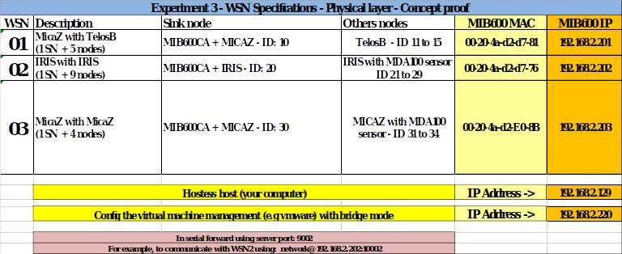
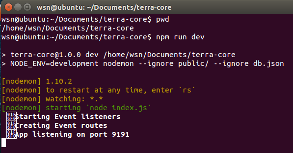
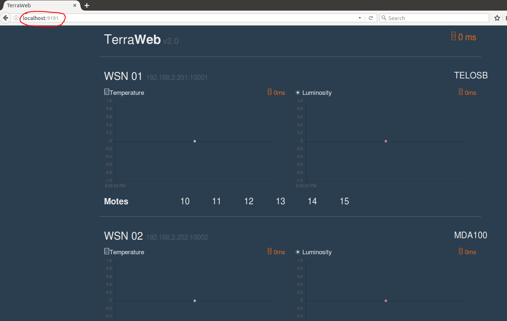
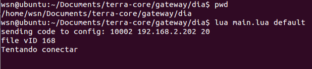
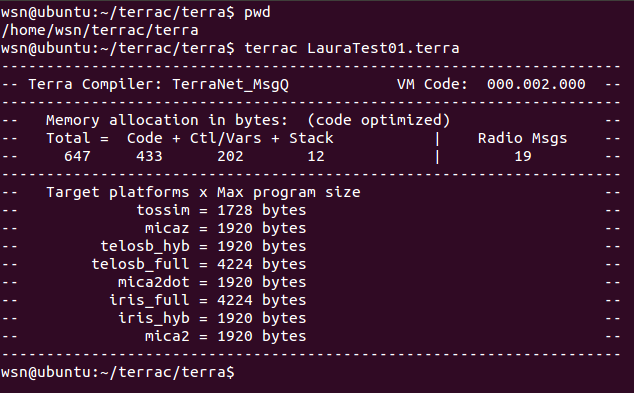
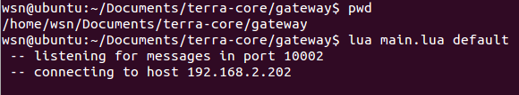
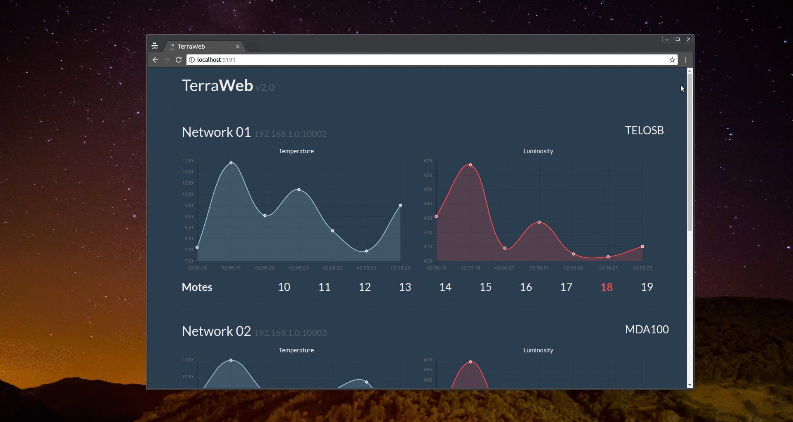

# LAURA architecture project

## LAURA architecture usability tutorial: how to use laura virtual machine

```
LAURA Project Team:
Adriano Francisco Branco - Afbranco@gmail.com
Bruno Alves Agrizzi - brunoagrizzi@gmail.com 
Isaac Simões Araújo Pereira - pereira.zc@gmail.com 
José Gonçalves Pereira Filho - zegonc@gmail.com
Ruan Rocha Martinelli - martinelliruan@gmail.com
Sergio Teixeira - sergio@multicast.com.br

```

### Chapter 1. Objectives and essential information 

#### 1.1 Objectives

The main object of this document is to present a step by step tutorial to guide and facilitate the work of those who intend to use the LAURA VM (Teixeira et al., 2017) to develop its own LAURA applied specific Wireless Sensor Network (WSN)/Internet of Things (IoT) final solution. 

The LAURA VM uses the technological choises initially proposed in <Paper awaiting approval>. In order to use the VM, it is necessary to make some settings according to hardware platform which you intend to use, the network design and other aspects related to the applied final application and the enterprise environment. This tutorial is reproducing the experiment 3, available in section 5.3 in <Paper awaiting approval>. Thus, is strongly recommended to read this study for better understanding of this tutorial
  
#### 1.2 Target stakeholder

This tutorial was developed to assist the developer or team of developers who wish to develop a LAURA applied specific WSN/IoT final solution based on LAURA architecture, using the ready to use LAURA VM with the technological choises made as described in section ‘4.4. LAURA Applied architecture’ <Paper awaiting approval>. 
  
This tutorial can be used by anyone who has the specific knowledge required or compatible with the professional profiles as described in section ‘4.1. Stakeholders’ <Paper awaiting approval>. In addition, this tutorial seeks to simplify and facilitate the use of the LAURA VM, demonstrating that it is relatively simple, requiring little knowledge of the lower level aspects that are usually performed by the WSN expert.
  
 #### 1.3 Network configurations, requirements and technical assumptions
 
 ##### 1.3.1 Network configuration and specifications used in the LAURA VM
 
 The LAURA VM is configured according to the specification and network settings used in the experiment 3, section 5.3 <Paper awaiting approval>. Table 1 presents WSN specification and some essential network configurations necessary to run the final application;
  
  
  
  If you have a MIB600 obviously, your MAC address will be different. If you do not use MIB600 Gateways you can connect the Sink node directly to your computer via USB port. We used static IP address. The network topology used in the VM is the same used in experiment 3, as shown in Figure 9 in <Paper awaiting approval>.
To assign an IP address to the Sink node you must use the ‘arp’ command. Follow the steps below to assign the IP address:
- Open the terminal and run the command "arp -s <ip> <MAC>". For example, to bind the IP address to the Sink node of WSN2 as previously shown in the Table 1, use the comand: "arp -s 192.168.2.202 00-20-4a-d2-d7-76";
- After linking the IP to the Sink node, it must be accessed via telnet to test the connection. Execute the command ‘telnet 192.168.2.202 1’ to verify the connection to the WSN2 Sink node;
- To verify the settings, execute the command ‘telnet 192.168.2.202 9999’;
- To exit the settings, press 8 to exit without saving.
  
##### 1.3.2 Requirements and technical assumptions

It is important to know the essential requirements and some technical assumptions necessary to use the LAURA VM. The essential requirements are:
- Read carefully the study <Paper awaiting approval> that presents the LAURA architecture;
- Know the basic concepts of Terra System and have the necessary knowledge to configure a sensor node with Terra System so that it is able to receive an update of the node code (bytecode);
- More details about Terra System can be obtained in Github project at: https://github.com/afbranco/Terra or http://afbranco.github.io/Terra/terra-home.html or in the study ‘Terra: Flexibility and Safety in Wireless Sensor Networks’ (Branco et al., 2015)
The technical assumptions necessary to use the LAURA VM are:
- The LAURA VM is already configured according to the information previously presented in section 1.3.1. However, it is necessary to observe the step by step guide presented in chapter 2. to be able to execute the final Terra Web Control application that is available in the VM;
- Before starting the step by step guide presented in chapter 2, we are assuming that the sensor nodes that you intend to use are already configured with Terra System, requiring only the dissemination of the node codes (bytecodes);
- This tutorial intends to introduce the LAURA architecture, reproducing the experiment 3. If you want to use other configurations, another hardware platform, run your own final application or if you intend to make any kind of modification in the LAURA VM, it is recommended to read the more detailed tutorial (available in the same repository) that guides you how to modify and adapt the VM, according to the requirements and specifications of your solution.
  
### Chapter 2. Step by step guide to use LAURA Architecture

This Chapter presents the necessary steps to make settings, run applications and preparing the VM to execute the final application.

#### 2.1 Download and execute the VM in your computer	

- LAURA VM is avaibable for download in the LAURA Project web site at:
  - https://github.com/laura-architecture/how-to-use-laura
- You can use the VM manager of your choice, however, it is important to know that we used the Vmware to test LAURA VM.

#### 2.2 Starting the `Terra Web Control` final application

- The goal of this step is to run the 'Terra Web Control' final application in order to view the sensed data of the WSN.
- This step will allow you to view the exact moment when the data will be displayed in this application, allowing you to identify whether the steps performed are working as expected.
- Access the folder `/home/wsn/Documents/terra-core` as shown in Figure 1;
- Open a terminal and execute the command `npm run dev` to start ‘Terra Web Control’;



- After executing the command, you will start the client part of the application that establishes the connection with the 'Terra Core' via Socke.io;
- You must open the Browser and enter the URL 'http://localhost: 9191' as shown in figure 2. From this point, the Web application is able to display the sensed data as soon as it is received;
- It is important to remember that the codes and other files available in this directory are also available in the GitHub repository of the LAURA project (Teixeira et al., 2017). This folder is a copy of the files that are in GitHub.



#### 2.3 Node Code Dissemination
- The experiment used in this tutorial is based on Terra System. Assuming that the node is already configured with Terra System, it is necessary to spread the code of the nodes (bytecodes) that will be running into the Terra Virtual Machine (VM-T);
- Details About Terra System or more informations about how to configure a Terra-based node are not part of the scope of this tutorial. For more details about Terra System, visit the project address in GitHub which is available at https://github.com/afbranco/Terra or at http://afbranco.github.io/Terra/terra-home.html;
- In order to disseminate the codes of the already compiled nodes you must use TerraDia application;
- Access the folder ‘/home/wsn/Documents/terra-core/gateway/dia’, open the terminal and execute de command `lua main.lua default` as shown in Figure 3;



- Before executing the command to disseminate the node codes, it is important to understand the parameters necessary to perform any `Terra Dia` dissemination. In addition, the compiled VM-T code (file: LauraTest01.vmx) must also be in the same folder;
- The default setting is already set in the main.lua file in the same folder;
- To run `Terra Dia` with a custom port, IP or sensor node ID, use the following command:
- ‘lua main.lua <port> <ip address> <nodeId>’
  - `port` : port address used;
  - `ip address`  Sink node IP address;
   - `nodeid` Sink node ID;
- To use the default configuration, simply execute the command 'lua main.lua default';
- After executing this command, the file LauraTest01.vmx will be disseminated to the WSN via Sink node, according to the existing configurations in the file 'main.lua';
- You must disseminate the codes (bytecodes) of each WSN at a time. In the current version of ‘Terra System’, it is not possible to disseminate different codes to different WSNs at the same time;
- If you want to make changes to the compiled code (LauraTest01.vmx) that will be disseminated, you need to modify the source file (LauraTest01.terra);
- Access the folder ‘/home/wsn/terrac/terra’, edit the source code and then compile;
- To compile use the command 'terrac LauraTest01.terra' as shown in figure 4;




#### 2.4. Start the ‘TerraGateway’ module

- TerraGateway is the module responsible for the connection between TerraCore and Sink Node. This module receives the sensed data from the WSN nodes and redirects them to the upper layers of the LAURA architecture;
- Access the folder `/home/wsn/Documents/terra-core/gateway/`, open the terminal and execute do command 'lua main.lua default' to run TerraGateway as show in figure 5; 
    


- Remember that this command will use the default settings that were previously made in the main.lua file in the same folder;
- After executing this command, the sensed data will be displayed in the ‘Terra Web Control’ application as shown in figure 6.

    
    
    
## References

- Branco, A., Sant ’anna, F., Ierusalimschy, R., Rodriguez, N., Rossetto, S., 2015. Terra: Flexibility and Safety in Wireless Sensor Networks. ACM Trans. Sen. Netw. Artic. 11, 18–23. https://doi.org/10.1145/2811267
- Teixeira, S., Agrizzi, B.A., Martinelli, R.R., Branco, A.F., Pereira, I.S.A., Al., E., 2017. LAURA Architecture: Codes, Experiments, Documentation, Videos and others related files [WWW Document]. URL https://laura-architecture.github.io (accessed 7.1.17).
 
    
    
